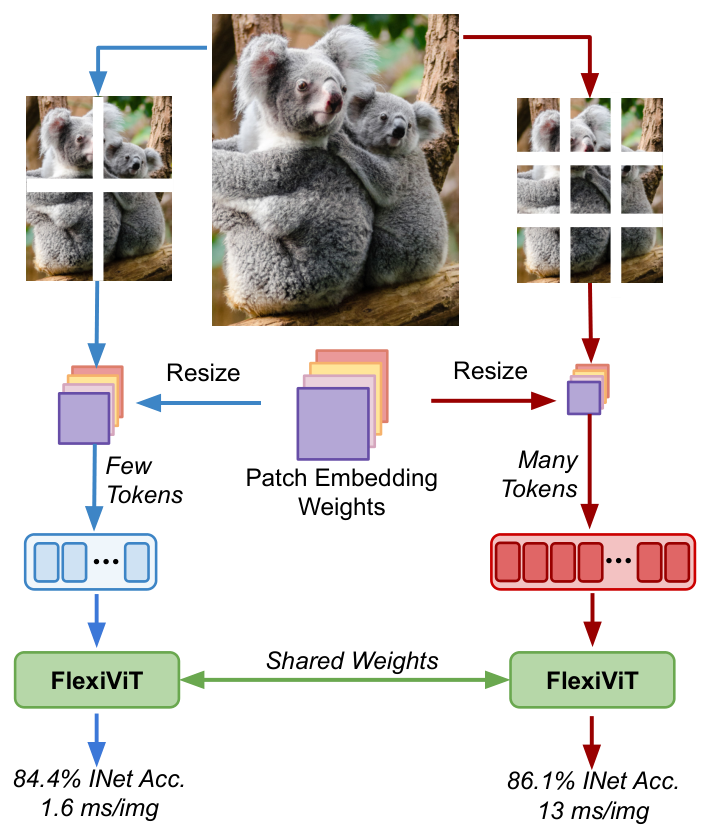

# FlexiViT

PyTorch reimplementation of ["FlexiViT: One Model for All Patch Sizes"](https://arxiv.org/abs/2212.08013).

<p align="center">

</p>

## Requirements
- Python 3.8+
- `pip install -r requirements`

## Usage
Here is a basic example of resizing the patch embedding layer of a pretrained model using the timm library:

```python
from timm import create_model
from timm.layers.pos_embed import resample_abs_pos_embed

from flexivit_pytorch import pi_resize_patch_embed

# Load the pretrained model's state_dict
state_dict = create_model("vit_base_patch16_224", pretrained=True).state_dict()

# Resize the patch embedding
new_patch_size = (32, 32)
state_dict["patch_embed.proj.weight"] = pi_resize_patch_embed(
    patch_embed=state_dict["patch_embed.proj.weight"], new_patch_size=new_patch_size
)

# Adjust the position embedding
image_size = 224
grid_size = image_size // new_patch_size[0]
state_dict["pos_embed"] = resample_abs_pos_embed(
    posemb=state_dict["pos_embed"], new_size=[grid_size, grid_size]
)

# Load new weights into model with target image and patch sizes
net = create_model(
    "vit_base_patch16_224", img_size=image_size, patch_size=new_patch_size
)
net.load_state_dict(state_dict, strict=True)
```

### Conversion Script
The patch embedding layer from a model checkpoint can be resized using `convert_patch_embed.py`. For example, to resize to a patch size of 20:
```
python convert_patch_embed.py -i vit-16.pt -o vit-20.pt -n patch_embed.proj.weight -ps 20 
```
or to a patch size of height 10 and width 15:
```
python convert_patch_embed.py -i vit-16.pt -o vit-10-15.pt -n patch_embed.proj.weight -ps 10 15
```
The `-n` argument corresponds to the name of patch embedding weights in the checkpoint's state dict.


## Citation
```bibtex
@article{beyer2022flexivit,
  title={FlexiViT: One Model for All Patch Sizes},
  author={Beyer, Lucas and Izmailov, Pavel and Kolesnikov, Alexander and Caron, Mathilde and Kornblith, Simon and Zhai, Xiaohua and Minderer, Matthias and Tschannen, Michael and Alabdulmohsin, Ibrahim and Pavetic, Filip},
  journal={arXiv preprint arXiv:2212.08013},
  year={2022}
}
```
