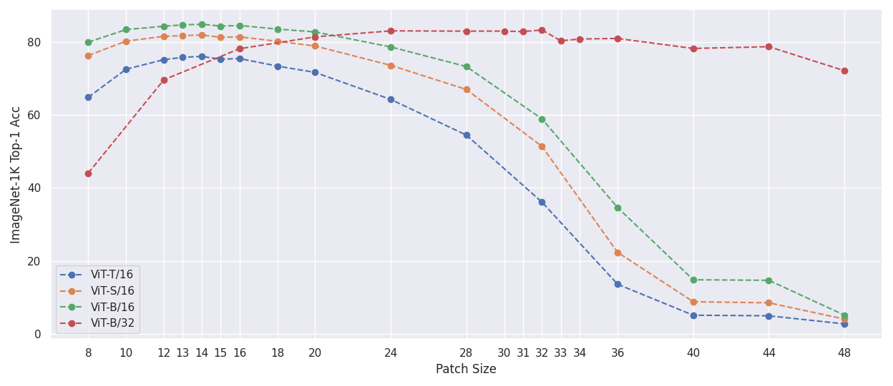
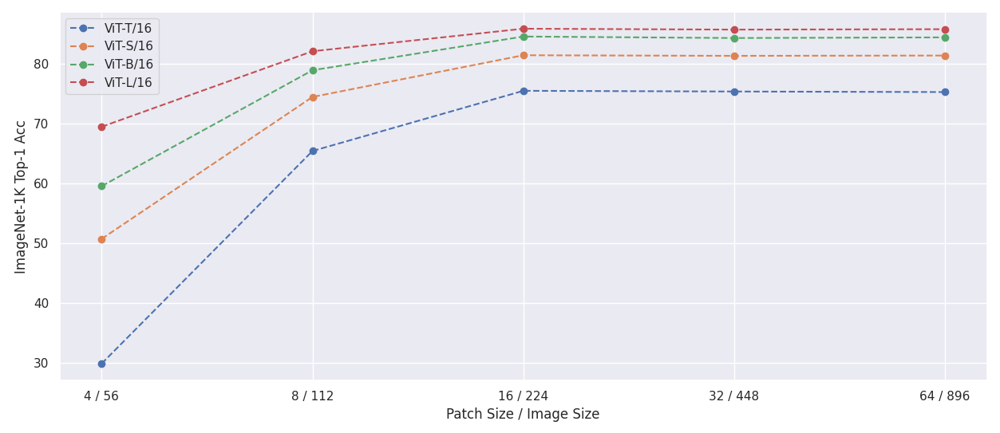

# FlexiViT

PyTorch reimplementation of ["FlexiViT: One Model for All Patch Sizes"](https://arxiv.org/abs/2212.08013).

<p align="center">

</p>

## Requirements
- Python 3.8+
- `pip install -r requirements`

## Usage
Here is a basic example of resizing the patch embedding layer of a pretrained model using the timm library:

```python
from timm import create_model
from timm.layers.pos_embed import resample_abs_pos_embed

from flexivit_pytorch import pi_resize_patch_embed

# Load the pretrained model's state_dict
state_dict = create_model("vit_base_patch16_224", pretrained=True).state_dict()

# Resize the patch embedding
new_patch_size = (32, 32)
state_dict["patch_embed.proj.weight"] = pi_resize_patch_embed(
    patch_embed=state_dict["patch_embed.proj.weight"], new_patch_size=new_patch_size
)

# Adjust the position embedding
image_size = 224
grid_size = image_size // new_patch_size[0]
state_dict["pos_embed"] = resample_abs_pos_embed(
    posemb=state_dict["pos_embed"], new_size=[grid_size, grid_size]
)

# Load new weights into model with target image and patch sizes
net = create_model(
    "vit_base_patch16_224", img_size=image_size, patch_size=new_patch_size
)
net.load_state_dict(state_dict, strict=True)
```

### Conversion Script
The patch embedding layer from a model checkpoint can be resized using `convert_patch_embed.py`. For example, to resize to a patch size of 20:
```
python convert_patch_embed.py -i vit-16.pt -o vit-20.pt -n patch_embed.proj.weight -ps 20 
```
or to a patch size of height 10 and width 15:
```
python convert_patch_embed.py -i vit-16.pt -o vit-10-15.pt -n patch_embed.proj.weight -ps 10 15
```
The `-n` argument corresponds to the name of patch embedding weights in the checkpoint's state dict.

## Experiments
The following experiments test using PI-resizing to change the patch size of standard ViT models during evaluation. All models have been fine-tuned on ImageNet-1k with a fixed patch size and are evaluated with different patch sizes.

#### Adjusting patch size and freezing image size to 224
<p align="center">

</p>

<details>
<summary>Numerical Results</summary>

| Patch Size | 8     | 10    | 12    | 13    | 14        | 15    | 16    | 18    | 20    | 24    | 28    | 32    | 36    | 40    | 44    | 48   |
|:----------:|-------|-------|-------|-------|-----------|-------|-------|-------|-------|-------|-------|-------|-------|-------|-------|------|
| ViT-T/16   | 64.84 | 72.54 | 75.18 | 75.80 | __76.06__ | 75.30 | 75.46 | 73.41 | 71.67 | 64.26 | 54.48 | 36.10 | 13.58 | 5.09  | 4.93  | 2.70 |
| ViT-S/16   | 76.31 | 80.24 | 81.56 | 81.76 | __81.93__ | 81.31 | 81.41 | 80.22 | 78.91 | 73.61 | 66.99 | 51.38 | 22.34 | 8.78  | 8.49  | 4.03 |
| ViT-B/16   | 79.97 | 83.41 | 84.33 | 84.70 | __84.87__ | 84.38 | 84.53 | 83.56 | 82.77 | 78.65 | 73.28 | 58.92 | 34.61 | 14.81 | 14.66 | 5.11 |


| Patch Size | 8     | 12    | 16    | 20    | 24    | 28    | 30    | 31    | 32        | 33    | 34    | 36    | 40    | 44    | 48    |
|:----------:|-------|-------|-------|-------|-------|-------|-------|-------|-----------|-------|-------|-------|-------|-------|-------|
| ViT-B/32   | 44.06 | 69.65 | 78.16 | 81.42 | 83.06 | 82.98 | 83.00 | 82.86 | __83.30__ | 80.34 | 80.82 | 80.98 | 78.24 | 78.72 | 72.14 | 
</details>

#### Adjusting patch and image size
- Maintaining the same number of tokens as during training

<p align="center">

</p>


<details>
<summary>Numerical Results</summary>

| Patch Size / Image Size | 4 / 56 | 8 / 112 | 16 / 224 | 32 / 224 | 64 / 896 |
|:-----------------------:|--------|---------|----------|----------|----------|
| ViT-T/16                | 29.81  | 65.39   | 75.46    | 75.34    | 75.25    |
| ViT-S/16                | 50.68  | 74.43   | 81.41    | 81.31    | 81.36    |
| ViT-B/16                | 59.51  | 78.90   | 84.54    | 84.29    | 84.40    |
| ViT-L/16                | 69.44  | 82.08   | 85.85    | 85.70    | 85.77    | 
</details>


## Citation
```bibtex
@article{beyer2022flexivit,
  title={FlexiViT: One Model for All Patch Sizes},
  author={Beyer, Lucas and Izmailov, Pavel and Kolesnikov, Alexander and Caron, Mathilde and Kornblith, Simon and Zhai, Xiaohua and Minderer, Matthias and Tschannen, Michael and Alabdulmohsin, Ibrahim and Pavetic, Filip},
  journal={arXiv preprint arXiv:2212.08013},
  year={2022}
}
```
